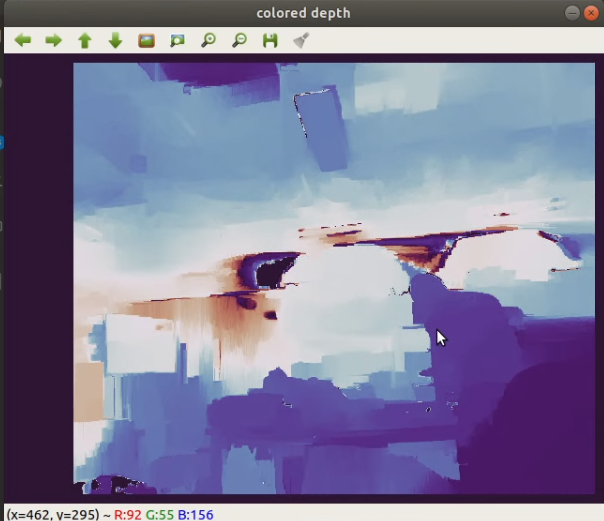

# Hornet 5.0 Stereovision

**Description:**
***The following files are provided by the manufacturer of the camera:***

- image geometry/*
- ocams_1cgn/withrobot_camera.cpp
- ocams_1cgn/withrobot_camera.hpp
- ocams_1cgn/withrobot_utility.cpp
- ocams_1cgn/withrobot_utility.hp

***The following file is the program entry:***

- ocams_1cgn/oCamS.cpp

***Detection range***

Detection range is approximately 1 to 15 meters, beyond which the value becomes very off.
The closest value of detection is about 0.8 meters (due to the length of baseline, any closer object makes it too hard to find a match).
The furthest value of detection is about 15 meters, beyond which the error becomes unacceptible (for example, it would mistake 20 meters as 30~40 meters).

## How to use/debug

After cmake, execute "rosrun ocams_1cgn ocams_1cgn" to start camera.

If you do not want to see the image window, you need to change show_image_ to false. (in oCamS.cpp)

By default, the shown image is a colored version of the depth map using COLORMAP_TWILIGHT_SHIFTED colormap.

**It publishes the following:**

| *Topic* | *Description* | *Data Type* |
| --------- | ----------- | ---------- |
| stereo/depth | depth map (values in meters, 0 means null) | sensor_msgs::Image |
| stereo/depth_time | Time stamp for depth map | sensor_msgs::TimeReference |
| motion/accelww | acceleration, angular velocity, orientation | sensor_msgs::Imu |
| motion/timestamp | time stamp for motion data | sensor_msgs::TimeReference |
| motion/magnetic | magnetic field data | sensor_msgs::MagneticField |
| stereo/left/image_raw | left raw image for calibration | sensor_msgs::Image |
| stereo/right/image_raw | right raw image for calibration | sensor_msgs::Image |

## Calibration Instructions

 1. Prepare a checkerboard.
 2. Build the workspace.
 3. Run "$ roslaunch ocams_1cgn calibration.launch".
 4. Move the board around, changing its position, orientation and distance (the entire board must be in view all the time).
 5. Once you see a "CALIBRATE" button on screen, click it.
 6. Program will hang. Wait for a while.
 7. If the epi. value is below 0.1, proceed to click "SAVE".
 8. Locate "/tmp/calibrationdata.tar.gz" and decompress it.
 9. Copy "left.yaml" and "right.yaml" to the config folder.
 10. Change the camera_name in the yaml files to "left" and "right" respectively.
 11. Test with "rosrun ocams_1cgn ocams_1cgn".

***If the calibration does not work, please wait for later updates.***

***Happy using Stereovision!***
